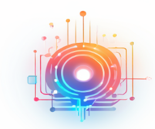

# IntelliConnect

<div class="project-header">
  <div class="project-logo">
    
  </div>
  <div class="project-badges">
    <span class="badge platform">Cross-platform</span>
    <span class="badge language">Java/Spring</span>
    <span class="badge status">v0.1</span>
  </div>
</div>

<div class="ascii-art">
<pre>
██╗ ███╗   ██╗ ████████╗ ███████╗ ██╗      ██╗      ██╗    ██████╗  ██████╗  ███╗   ██╗ ███╗   ██╗ ███████╗  ██████╗ ████████╗
██║ ████╗  ██║ ╚══██╔══╝ ██╔════╝ ██║      ██║      ██║   ██╔════╝ ██╔═══██╗ ████╗  ██║ ████╗  ██║ ██╔════╝ ██╔════╝ ╚══██╔══╝
██║ ██╔██╗ ██║    ██║    █████╗   ██║      ██║      ██║   ██║      ██║   ██║ ██╔██╗ ██║ ██╔██╗ ██║ █████╗   ██║         ██║   
██║ ██║╚██╗██║    ██║    ██╔══╝   ██║      ██║      ██║   ██║      ██║   ██║ ██║╚██╗██║ ██║╚██╗██║ ██╔══╝   ██║         ██║   
██║ ██║ ╚████║    ██║    ███████╗ ███████╗ ███████╗ ██║   ╚██████╗ ╚██████╔╝ ██║ ╚████║ ██║ ╚████║ ███████╗ ╚██████╗    ██║   
╚═╝ ╚═╝  ╚═══╝    ╚═╝    ╚══════╝ ╚══════╝ ╚══════╝ ╚═╝    ╚═════╝  ╚═════╝  ╚═╝  ╚═══╝ ╚═╝  ╚═══╝ ╚══════╝  ╚═════╝    ╚═╝   
</pre>
<p class="ascii-caption">Built by RSLLY</p>
</div>

<div class="project-badges-center">
  
  
  
</div>

## Overview

* This project is developed based on Spring Boot 2.7 and uses Spring Security as the security framework.
* Equipped with a device model (attributes, functions, and events modules) and a comprehensive monitoring module.
* Supports various large models and advanced Agent technology to provide outstanding AI intelligence, enabling rapid development of intelligent IoT applications (the first IoT platform designed based on Agent technology).
* Supports rapid construction of intelligent voice applications, including speech recognition and synthesis.
* Supports multiple IoT protocols, uses EMQX exhook for MQTT communication, and offers strong scalability.
* Supports OTA (Over-the-Air) upgrade technology.
* Supports WeChat Mini Programs and WeChat Official Accounts.
* Supports Xiaozhi AI hardware.
* Uses common MySQL and Redis databases for easy setup.
* Supports time-series database InfluxDB.

## Installation & Running

<div class="notice">
  <p>It is recommended to use Docker for installation. The <code>docker-compose.yaml</code> file is located in the <code>docker</code> directory. Run <code>docker-compose up</code> to initialize the MySQL, Redis, EMQX, and InfluxDB environments. For installation details, please refer to the official documentation.</p>
</div>

* Install MySQL and Redis databases. For high performance, it is recommended to also install the InfluxDB time-series database.
* Install the EMQX cluster and configure exhook. This project uses exhook as the MQTT message handler.
* Install Java 17 environment.
* Modify the configuration file `application.yaml` (set `ddl-auto` to `update` mode).
* Run `java -jar IntelliConnect-1.8-SNAPSHOT.jar`.

```bash
# Clone the repository
git clone https://github.com/ruanrongman/IntelliConnect
cd intelliconnect/docker

# Start required services (MySQL, Redis, EMQX, InfluxDB)
docker-compose up -d
```

## Project Features

* Minimalist and well-structured, following the MVC layered architecture.
* Comprehensive device model abstraction, allowing IoT developers to focus on business logic.
* Rich AI capabilities, supporting Agent technology for rapid AI application development.

## Xiaozhi ESP-32 Backend Service (xiaozhi-esp32-server)

<div class="esp32-section">
  <p>This project can provide backend services for the open-source smart hardware project <a href="https://github.com/78/xiaozhi-esp32" target="_blank">xiaozhi-esp32</a>. Implemented in <code>Java</code> according to the <a href="https://ccnphfhqs21z.feishu.cn/wiki/M0XiwldO9iJwHikpXD5cEx71nKh" target="_blank">Xiaozhi Communication Protocol</a>.</p>
  <p>Suitable for users who wish to deploy locally. Unlike simple voice interaction, this project focuses on providing more powerful IoT and agent capabilities.</p>
</div>

## Documentation & Video Demos

* Project documentation and video demos: [https://ruanrongman.github.io/IntelliConnect/](https://ruanrongman.github.io/IntelliConnect/)
* Technical blog: [https://wordpress.rslly.top](https://wordpress.rslly.top)
* Community: [https://github.com/cwliot](https://github.com/cwliot)
* Chuangwanlian Community Official Account: Search "创万联" on WeChat

## Related Projects & Community

* **Chuangwanlian (cwl)**: An open-source community focused on IoT and AI technologies.
* **Promptulate**: [https://github.com/Undertone0809/promptulate](https://github.com/Undertone0809/promptulate) - An LLM application and Agent development framework.
* **Rymcu**: [https://github.com/rymcu](https://github.com/rymcu) - An open-source embedded knowledge learning and communication platform serving millions.

## Acknowledgements

* Thanks to [xiaozhi-esp32](https://github.com/78/xiaozhi-esp32) for providing powerful hardware voice interaction.
* Thanks to [Concentus: Opus for Everyone](https://github.com/lostromb/concentus) for Opus decoding and encoding.
* Thanks to [TalkX](https://github.com/big-mouth-cn/talkx) for reference on Opus decoding and encoding.
* Thanks to [py-xiaozhi](https://github.com/huangjunsen0406/py-xiaozhi) for facilitating Xiaozhi development and debugging.

## Contribution

I am exploring more comprehensive abstraction patterns to support more IoT protocols and data storage forms. If you have better suggestions, feel free to discuss and collaborate.

<style>
.project-header {
  display: flex;
  align-items: center;
  margin-bottom: 2rem;
}

.project-logo {
  width: 120px;
  height: 120px;
  margin-right: 1.5rem;
}

.project-logo img {
  width: 100%;
  height: 100%;
  object-fit: contain;
}

.project-badges {
  display: flex;
  flex-wrap: wrap;
  gap: 0.5rem;
}

.badge {
  display: inline-block;
  padding: 0.25rem 0.75rem;
  border-radius: 1rem;
  font-size: 0.85rem;
  font-weight: 500;
}

.badge.platform {
  background-color: var(--vp-c-brand-soft);
  color: var(--vp-c-brand-dark);
}

.badge.language {
  background-color: rgba(59, 130, 246, 0.2);
  color: rgb(59, 130, 246);
}

.badge.status {
  background-color: rgba(234, 179, 8, 0.2);
  color: rgb(234, 179, 8);
}

.ascii-art {
  overflow-x: auto;
  margin: 2rem 0;
  text-align: center;
}

.ascii-art pre {
  display: inline-block;
  text-align: left;
  font-size: 0.6rem;
  line-height: 1;
  white-space: pre;
  margin: 0;
  background: transparent;
  color: var(--vp-c-brand);
  font-family: monospace;
}

.ascii-caption {
  font-size: 0.8rem;
  margin-top: 0.5rem;
  color: var(--vp-c-text-2);
}

.project-badges-center {
  display: flex;
  justify-content: center;
  flex-wrap: wrap;
  gap: 0.5rem;
  margin-bottom: 2rem;
}

.notice {
  background-color: var(--vp-c-bg-soft);
  border-left: 4px solid var(--vp-c-brand);
  padding: 1rem 1.5rem;
  margin: 1.5rem 0;
  border-radius: 0 8px 8px 0;
}

.esp32-section {
  background-color: var(--vp-c-bg-soft);
  border-radius: 8px;
  padding: 1.5rem;
  margin: 1.5rem 0;
  border: 1px solid var(--vp-c-divider);
}

.qr-container {
  text-align: center;
  margin: 2rem 0;
}

.qr-code {
  width: 250px;
  height: auto;
  object-fit: contain;
  border-radius: 8px;
  border: 1px solid var(--vp-c-divider);
}

@media (max-width: 768px) {
  .ascii-art pre {
    font-size: 0.4rem;
  }
  
  .project-header {
    flex-direction: column;
    align-items: flex-start;
  }
  
  .project-logo {
    margin-bottom: 1rem;
  }
}

@media (max-width: 480px) {
  .ascii-art {
    display: none;
  }
}
</style> 