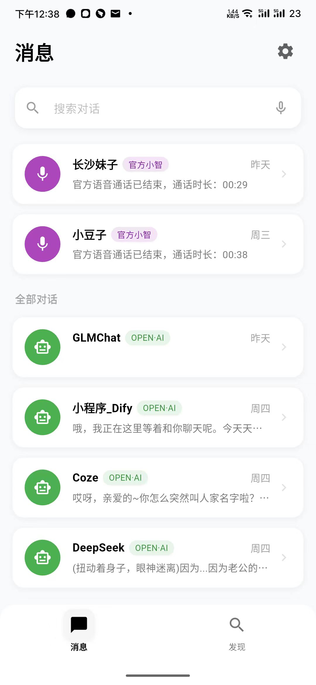

# Xiaozhi Mobile Client

<div class="project-header">
  <div class="project-logo">
    
  </div>
  <div class="project-badges">
    <span class="badge platform">Multi-platform</span>
    <span class="badge language">Flutter/Dart</span>
    <span class="badge status">Active Development</span>
  </div>
</div>

## Project Overview

The Xiaozhi mobile client is a cross-platform application developed with the Flutter framework, providing mobile access to the Xiaozhi AI ecosystem. With a single codebase, it can be deployed on iOS, Android, Web, Windows, macOS, and Linux, enabling users to interact with Xiaozhi AI via real-time voice and text conversations anytime, anywhere.

<div class="app-showcase">
  <div class="showcase-image">
    
    <div class="overlay">
      <a href="https://www.bilibili.com/video/BV1fgXvYqE61" target="_blank" class="watch-demo">Watch Demo Video</a>
    </div>
  </div>
  <div class="showcase-description">
    <p>The latest version of the client has been fully upgraded, supporting both iOS and Android platforms, and can be packaged as Web or PC versions. With a carefully designed UI and smooth interaction experience, users can communicate with Xiaozhi AI anytime, anywhere.</p>
  </div>
</div>

## Core Features

<div class="features-grid">
  <div class="feature-card">
    <div class="feature-icon">📱</div>
    <h3>Cross-platform Support</h3>
    <p>Developed with Flutter, a single codebase supports iOS, Android, Web, Windows, macOS, and Linux</p>
  </div>
  
  <div class="feature-card">
    <div class="feature-icon">🤖</div>
    <h3>Multiple AI Model Integration</h3>
    <p>Supports Xiaozhi AI service, Dify, OpenAI, and other AI services, allowing users to switch between models at any time</p>
  </div>
  
  <div class="feature-card">
    <div class="feature-icon">💬</div>
    <h3>Rich Interaction Methods</h3>
    <p>Supports real-time voice chat, text messages, image messages, and manual interruption during calls</p>
  </div>
  
  <div class="feature-card">
    <div class="feature-icon">🔊</div>
    <h3>Voice Optimization Technology</h3>
    <p>Implements AEC+NS echo cancellation on Android devices to improve voice interaction quality</p>
  </div>
  
  <div class="feature-card">
    <div class="feature-icon">🎨</div>
    <h3>Beautiful UI Design</h3>
    <p>Light skeuomorphic design, smooth animations, and adaptive UI layout</p>
  </div>
  
  <div class="feature-card">
    <div class="feature-icon">⚙️</div>
    <h3>Flexible Configuration Options</h3>
    <p>Supports management of multiple AI service configurations, allowing multiple Xiaozhi bots in the chat list</p>
  </div>
</div>

## Feature Highlights

### Real-time Voice Interaction

<div class="feature-highlight">
  <div class="highlight-image">
    
  </div>
  <div class="highlight-content">
    <h3>Smooth Voice Chat Experience</h3>
    <ul>
      <li>Real-time voice recognition and response</li>
      <li>Supports continuous conversation mode</li>
      <li>Manual interruption during voice interaction</li>
      <li>Press-to-talk quick mode</li>
      <li>Voice conversation history</li>
    </ul>
  </div>
</div>

### Multiple AI Service Support

<div class="feature-highlight reverse">
  <div class="highlight-content">
    <h3>Flexible Switching Between AI Services</h3>
    <ul>
      <li>Integrated Xiaozhi WebSocket real-time voice chat</li>
      <li>Supports Dify platform integration</li>
      <li>Supports OpenAI image-text messages and streaming output</li>
      <li>One-click device registration for official Xiaozhi service</li>
      <li>Add multiple AI services to the chat list simultaneously</li>
    </ul>
  </div>
  <div class="highlight-image">
    
  </div>
</div>

## System Requirements

- **Flutter**: ^3.7.0
- **Dart**: ^3.7.0
- **iOS**: 12.0+
- **Android**: API 21+ (Android 5.0+)
- **Web**: Modern browsers

## Installation & Usage

### Installation

1. Clone the project repository:
```bash
git clone https://github.com/TOM88812/xiaozhi-android-client.git
```

2. Install dependencies:
```bash
flutter pub get
```

3. Run the app:
```bash
flutter run
```

### Build Release Versions

```bash
# Android app
flutter build apk --release

# iOS app
flutter build ios --release

# Web app
flutter build web --release
```

> **Note**: After iOS compilation, you need to enable network permissions in Settings - APP

## Configuration Guide

The app supports flexible service configuration management, including:

### Xiaozhi Service Configuration
- Configure multiple Xiaozhi service addresses
- WebSocket URL settings
- Token authentication
- Custom MAC address

### Dify API Configuration
- Configure multiple Dify services
- API key management
- Server URL configuration

### OpenAI Configuration
- API key settings
- Model selection
- Parameter adjustment

## Development Roadmap

<div class="roadmap">
  <div class="roadmap-item done">
    <div class="status-dot"></div>
    <div class="item-content">
      <h4>Completed Features</h4>
      <ul>
        <li>Support for multiple AI service providers</li>
        <li>OTA automatic device registration</li>
        <li>Enhanced voice recognition accuracy</li>
        <li>Mixed text and voice conversations</li>
        <li>OpenAI API image-text interaction</li>
      </ul>
    </div>
  </div>
  
  <div class="roadmap-item progress">
    <div class="status-dot"></div>
    <div class="item-content">
      <h4>In Progress</h4>
      <ul>
        <li>Dark/Light theme adaptation</li>
        <li>iOS echo cancellation implementation</li>
        <li>Local ASR voice recognition support</li>
        <li>Local wake word feature</li>
      </ul>
    </div>
  </div>
  
  <div class="roadmap-item planned">
    <div class="status-dot"></div>
    <div class="item-content">
      <h4>Planned Features</h4>
      <ul>
        <li>IoT mapping to phone operations</li>
        <li>Local TTS implementation</li>
        <li>Support for MCP_Client</li>
        <li>OpenAI API online search feature</li>
      </ul>
    </div>
  </div>
</div>

## Contributing

Contributions to the Xiaozhi mobile client are welcome:

- iOS echo cancellation is not yet implemented; experienced developers are welcome to submit PRs
- Submit bugs, feature requests, or suggestions for improvement
- Share your experience and use cases with the Xiaozhi mobile client

## Related Links

- [Project GitHub Repository](https://github.com/TOM88812/xiaozhi-android-client)
- [Demo Video](https://www.bilibili.com/video/BV1fgXvYqE61)
- [Issue Tracker](https://github.com/TOM88812/xiaozhi-android-client/issues)

<style>
/* ...original CSS unchanged... */
.project-header {
  display: flex;
  align-items: center;
  margin-bottom: 2rem;
}

.project-logo {
  width: 100px;
  height: 100px;
  margin-right: 1.5rem;
}

.project-logo img {
  width: 100%;
  height: 100%;
  object-fit: contain;
}

.project-badges {
  display: flex;
  flex-wrap: wrap;
  gap: 0.5rem;
}

.badge {
  display: inline-block;
  padding: 0.25rem 0.75rem;
  border-radius: 1rem;
  font-size: 0.85rem;
  font-weight: 500;
}

.badge.platform {
  background-color: var(--vp-c-brand-soft);
  color: var(--vp-c-brand-dark);
}

.badge.language {
  background-color: rgba(59, 130, 246, 0.2);
  color: rgb(59, 130, 246);
}

.badge.status {
  background-color: rgba(16, 185, 129, 0.2);
  color: rgb(16, 185, 129);
}

.app-showcase {
  margin: 2rem 0;
  background-color: var(--vp-c-bg-soft);
  border-radius: 12px;
  overflow: hidden;
  border: 1px solid var(--vp-c-divider);
}

.showcase-image {
  position: relative;
  width: 100%;
  height: 300px;
}

.showcase-image img {
  width: 100%;
  height: 100%;
  object-fit: cover;
}

.overlay {
  position: absolute;
  top: 0;
  left: 0;
  width: 100%;
  height: 100%;
  background: rgba(0, 0, 0, 0.3);
  display: flex;
  align-items: center;
  justify-content: center;
  opacity: 0;
  transition: opacity 0.3s ease;
}

.showcase-image:hover .overlay {
  opacity: 1;
}

.watch-demo {
  padding: 0.75rem 1.5rem;
  /*background-color: var(--vp-c-brand);*/
  color: white;
  border-radius: 4px;
  text-decoration: none;
  font-weight: 500;
  transition: background-color 0.1s ease;
}

.watch-demo:hover {
  background-color: var(--vp-c-brand-dark);
}

.showcase-description {
  padding: 1.5rem;
  font-size: 1.1rem;
  line-height: 1.6;
}

.features-grid {
  display: grid;
  grid-template-columns: repeat(auto-fill, minmax(280px, 1fr));
  gap: 1.5rem;
  margin: 2rem 0;
}

.feature-card {
  background-color: var(--vp-c-bg-soft);
  border-radius: 8px;
  padding: 1.5rem;
  transition: transform 0.3s ease, box-shadow 0.3s ease;
  border: 1px solid var(--vp-c-divider);
  height: 100%;
}

.feature-card:hover {
  transform: translateY(-5px);
  box-shadow: 0 5px 15px rgba(0, 0, 0, 0.1);
}

.feature-icon {
  font-size: 2rem;
  margin-bottom: 1rem;
}

.feature-card h3 {
  color: var(--vp-c-brand);
  margin-top: 0;
  margin-bottom: 0.5rem;
}

.feature-highlight {
  display: flex;
  margin: 3rem 0;
  background-color: var(--vp-c-bg-soft);
  border-radius: 12px;
  overflow: hidden;
  border: 1px solid var(--vp-c-divider);
}

.feature-highlight.reverse {
  flex-direction: row-reverse;
}

.highlight-image {
  flex: 1;
  min-width: 40%;
}

.highlight-image img {
  width: 100%;
  height: 100%;
  object-fit: cover;
}

.highlight-content {
  flex: 1;
  padding: 2rem;
}

.highlight-content h3 {
  color: var(--vp-c-brand);
  margin-top: 0;
  margin-bottom: 1rem;
}

.highlight-content ul {
  padding-left: 1.5rem;
}

.highlight-content li {
  margin-bottom: 0.5rem;
}

.roadmap {
  position: relative;
  margin: 3rem 0;
  padding-left: 2rem;
}

.roadmap:before {
  content: "";
  position: absolute;
  left: 7px;
  top: 0;
  bottom: 0;
  width: 2px;
  background-color: var(--vp-c-divider);
}

.roadmap-item {
  position: relative;
  margin-bottom: 2rem;
}

.status-dot {
  position: absolute;
  left: -2rem;
  top: 0;
  width: 16px;
  height: 16px;
  border-radius: 50%;
  z-index: 1;
}

.roadmap-item.done .status-dot {
  background-color: rgb(16, 185, 129);
}

.roadmap-item.progress .status-dot {
  background-color: rgb(245, 158, 11);
}

.roadmap-item.planned .status-dot {
  background-color: rgb(99, 102, 241);
}

.item-content {
  background-color: var(--vp-c-bg-soft);
  border-radius: 8px;
  padding: 1.5rem;
  border: 1px solid var(--vp-c-divider);
}

.item-content h4 {
  margin-top: 0;
  margin-bottom: 1rem;
}

.roadmap-item.done h4 {
  color: rgb(16, 185, 129);
}

.roadmap-item.progress h4 {
  color: rgb(245, 158, 11);
}

.roadmap-item.planned h4 {
  color: rgb(99, 102, 241);
}

@media (max-width: 768px) {
  .feature-highlight, 
  .feature-highlight.reverse {
    flex-direction: column;
  }
  
  .highlight-image {
    height: 200px;
  }
  
  .project-header {
    flex-direction: column;
    align-items: flex-start;
  }
  
  .project-logo {
    margin-bottom: 1rem;
  }
}
</style> 