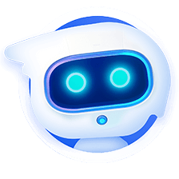

# xiaozhi-esp32-server

  

    
  

  

    ESP32
    Python
    Active Development
  

  
xiaozhi-esp32-server is a backend service for the open-source smart hardware project <a href="https://github.com/78/xiaozhi-esp32" target="_blank">xiaozhi-esp32</a>. It is implemented in Python according to the <a href="https://ccnphfhqs21z.feishu.cn/wiki/M0XiwldO9iJwHikpXD5cEx71nKh" target="_blank">Xiaozhi Communication Protocol</a>, helping you quickly set up your own Xiaozhi server.

## Target Audience

This project is intended for use with ESP32 hardware devices. If you have already purchased ESP32 hardware, successfully connected to the backend service deployed by Xiage, and want to set up your own independent `xiaozhi-esp32` backend, this project is for you.

  <h3>⚠️ Important Notice</h3>
  <ol>
    <li>This project is open-source software and has no commercial relationship with any third-party API service providers (including but not limited to speech recognition, LLMs, TTS platforms, etc.). It does not guarantee the quality or financial security of their services. Users are advised to choose providers with proper business licenses and carefully read their service agreements and privacy policies. This software does not host any account keys, does not participate in financial transactions, and does not bear any risk of fund loss.</li>
    <li>This project is relatively new and has not passed network security assessments. Do not use it in production environments. If you deploy this project on a public network for learning purposes, be sure to enable protection in the <code>config.yaml</code> configuration file.</li>
  </ol>

## Core Features

  

    
🔄

    <h3>Communication Protocol</h3>
    
Based on the <code>xiaozhi-esp32</code> protocol, data exchange via WebSocket

  

  
  

    
💬

    <h3>Dialogue Interaction</h3>
    
Supports wake-up dialogue, manual dialogue, real-time interruption, and auto-sleep after inactivity

  

  
  

    
🧠

    <h3>Intent Recognition</h3>
    
Supports LLM-based intent recognition and function call, reducing hardcoded intent logic

  

  
  

    
🌐

    <h3>Multilingual Recognition</h3>
    
Supports Mandarin, Cantonese, English, Japanese, Korean (default: FunASR)

  

  
  

    
🤖

    <h3>LLM Module</h3>
    
Flexible LLM module switching. Default: ChatGLMLLM. Also supports Alibaba Bailian, DeepSeek, Ollama, etc.

  

  
  

    
🔊

    <h3>TTS Module</h3>
    
Supports EdgeTTS (default), Doubao TTS, and more, meeting various speech synthesis needs

  

  
  

    
📝

    <h3>Memory Function</h3>
    
Supports long-term memory, local summary memory, and no-memory modes for different scenarios

  

  
  

    
🏠

    <h3>IOT Functionality</h3>
    
Manage registered IOT devices and control smart home devices based on dialogue context

  

  
  

    
🖥️

    <h3>Smart Console</h3>
    
Web management interface for agent management, user management, system configuration, etc.

  

## Deployment Methods

This project provides two deployment methods. Choose according to your needs:

  <table>
    <thead>
      <tr>
        <th>Deployment Method</th>
        <th>Features</th>
        <th>Use Case</th>
      </tr>
    </thead>
    <tbody>
      <tr>
        <td><strong>Minimal Installation</strong></td>
        <td>Smart dialogue, IOT functionality, data stored in config files</td>
        <td>Low-resource environments, no database required</td>
      </tr>
      <tr>
        <td><strong>Full Module Installation</strong></td>
        <td>Smart dialogue, IOT, OTA, Smart Console, data stored in database</td>
        <td>Full feature experience</td>
      </tr>
    </tbody>
  </table>

For detailed deployment documentation, see:
- [Docker Deployment Guide](https://github.com/xinnan-tech/xiaozhi-esp32-server/blob/main/docs/Deployment.md)
- [Source Code Deployment Guide](https://github.com/xinnan-tech/xiaozhi-esp32-server/blob/main/docs/Deployment_all.md)

## Supported Platforms

xiaozhi-esp32-server supports a wide range of third-party platforms and components:

### LLM Language Models

  <h4>API Integration</h4>
  
<strong>Supported Platforms:</strong> Alibaba Bailian, Doubao, DeepSeek, Zhipu ChatGLM, Gemini, Ollama, Dify, Fastgpt, Coze

  
<strong>Free Platforms:</strong> Zhipu ChatGLM, Gemini

  
<em>Any LLM supporting the OpenAI API can be integrated</em>

### TTS Speech Synthesis

  <h4>API Integration</h4>
  
<strong>Supported Platforms:</strong> EdgeTTS, Doubao TTS, Tencent Cloud, Alibaba Cloud TTS, CosyVoiceSiliconflow, TTS302AI, CozeCnTTS, GizwitsTTS, ACGNTTS, OpenAITTS

  
<strong>Free Platforms:</strong> EdgeTTS, CosyVoiceSiliconflow (partial)

  
  <h4>Local Services</h4>
  
<strong>Supported Platforms:</strong> FishSpeech, GPT_SOVITS_V2, GPT_SOVITS_V3, MinimaxTTS

  
<strong>Free Platforms:</strong> FishSpeech, GPT_SOVITS_V2, GPT_SOVITS_V3, MinimaxTTS

### ASR Speech Recognition

  <h4>API Integration</h4>
  
<strong>Supported Platforms:</strong> DoubaoASR

  
  <h4>Local Services</h4>
  
<strong>Supported Platforms:</strong> FunASR, SherpaASR

  
<strong>Free Platforms:</strong> FunASR, SherpaASR

### More Components

- **VAD Voice Activity Detection**: Supports SileroVAD (local, free)
- **Memory Storage**: Supports mem0ai (1000 times/month), mem_local_short (local summary, free)
- **Intent Recognition**: Supports intent_llm (LLM-based intent recognition), function_call (intent via LLM function call)

## Contributing

xiaozhi-esp32-server is an active open-source project. Contributions and feedback are welcome:

- [GitHub Repository](https://github.com/xinnan-tech/xiaozhi-esp32-server)
- [Issue Tracker](https://github.com/xinnan-tech/xiaozhi-esp32-server/issues)
- [Open Letter to Developers](https://github.com/xinnan-tech/xiaozhi-esp32-server/blob/main/docs/contributor_open_letter.md)

 