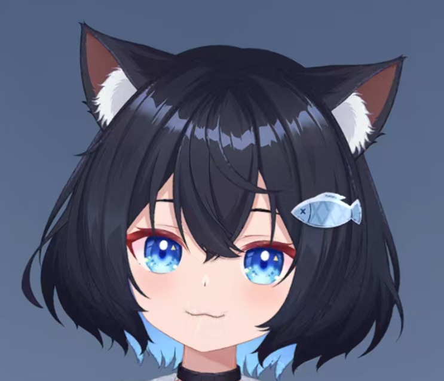

# XiaoZhiAI_server32_Unity

<div class="project-header">
  <div class="project-logo">
    
  </div>
  <div class="project-badges">
    <span class="badge platform">Cross-platform</span>
    <span class="badge language">C#/Unity</span>
    <span class="badge status">Active Development</span>
  </div>
</div>

## Project Overview

XiaoZhiAI_server32_Unity is an AI application developed with Unity, focusing on high-quality voice interaction and network service features. Leveraging Unity's cross-platform capabilities, it supports various devices and operating systems, including PC, Android, iOS, WebGL, and WeChat Mini Programs, providing users with a smooth AI voice and Live2D interaction experience.

## Technical Architecture

XiaoZhiAI_server32_Unity is built on the following tech stack:

- **Engine**: Unity 2020.3 or later
- **Target Platforms**: PC, Android, iOS, WebGL, WeChat Mini Programs
- **Core Modules**:
  - **Voice Interaction System**: Real-time speech recognition, natural language processing, speech synthesis
  - **Live2D Interaction**: Server returns LLM-driven Live2D facial expressions
  - **Mqtt Hardware Interaction**: Server-side function call handling for IoT responses

- **Dependencies**:
  - OPUS decoding SDK
  - WebSocket networking library
  - YooAsset asset management framework v2.3.7
  - YuikFrameWork (YOO branch)
  - Hycrl hot update framework

## Core Features

### Voice Interaction Capabilities

<div class="features-grid">
  <div class="feature-card">
    <div class="feature-icon">🎤</div>
    <h3>Real-time Speech Recognition</h3>
    <p>Supports real-time speech-to-text in multiple languages, with accuracy over 95%</p>
  </div>
  
  <div class="feature-card">
    <div class="feature-icon">🧠</div>
    <h3>Natural Language Understanding</h3>
    <p>Deep learning-based semantic analysis for precise intent recognition</p>
  </div>
  
  <div class="feature-card">
    <div class="feature-icon">🔊</div>
    <h3>Speech Synthesis</h3>
    <p>Natural and fluent voice output, supporting various tones and adjustable speed</p>
  </div>
  
  <div class="feature-card">
    <div class="feature-icon">🤖</div>
    <h3>Live2D Facial Interaction</h3>
    <p>Real-time facial expression changes and emotion display based on LLM results</p>
  </div>
  
  <div class="feature-card">
    <div class="feature-icon">📱</div>
    <h3>IoT & Mqtt Integration</h3>
    <p>Control smart home devices and receive status feedback via function calls</p>
  </div>
  
  <div class="feature-card">
    <div class="feature-icon">🔄</div>
    <h3>Hot Update Support</h3>
    <p>Upgrade without reinstalling, powered by the Hycrl framework</p>
  </div>
</div>

## Environment Requirements

### Development Environment
- Unity version: 2020.3 or later
- OS: Windows 10/11 (development)

### Runtime Environment
- **PC**:
  - OS: Windows 10/11, macOS 10.14+
  - CPU: Intel i5 or equivalent
  - RAM: 8GB+
  - GPU: DirectX 11 support
  
- **Mobile**:
  - Android 6.0+
  - iOS 11.0+
  
- **Web**:
  - Modern browsers supporting WebGL 2.0

- **Hardware**:
  - Microphone: High-quality mic supporting 16kHz sampling (for voice interaction)
  - Network: Stable connection, 5Mbps+ recommended

## Project Structure

```
XiaoZhiAI_server32_Unity/
├── Assets/                      # Unity assets
│   ├── Scenes/                  # Scene files
│   ├── Scripts/                 # Script files
│   │   ├── VoiceInteraction/    # Voice interaction scripts
│   │   ├── Networking/          # Networking scripts
│   │   └── ...
│   ├── Prefabs/                 # Prefabs
│   ├── Plugins/                 # Third-party plugins
│   │   ├── VoiceSDK/            # Speech recognition SDK
│   │   └── NetworkLibs/         # Networking libraries
│   └── ...
├── Packages/                    # Project dependencies
├── ProjectSettings/             # Unity project settings
└── README.md                    # Project documentation
```

## Installation Guide

### For Developers

1. Clone the repository:
   ```bash
   git clone https://gitee.com/vw112266/XiaoZhiAI_server32_Unity.git
   ```

2. Install dependencies:
   - Manually import YooAsset framework (v2.3.7): https://github.com/tuyoogame/YooAsset
   - Manually import YuikFrameWork-YOO branch: https://gitee.com/NikaidoShinku/YukiFrameWork

3. Open the project with Unity Hub and ensure version compatibility

### For Users

1. Download the installer for your platform from the releases page
2. Follow the setup wizard
3. Launch the app and complete initial configuration

## Feature Showcase

### Live2D Interaction

<div class="feature-highlight">
  <div class="highlight-content">
    <h3>Expressive Live2D Models</h3>
    <ul>
      <li>Real-time facial expression changes based on conversation</li>
      <li>Supports multiple emotional states</li>
      <li>Accurate lip-sync</li>
      <li>Natural blinking and head movement</li>
      <li>Customizable character appearance</li>
    </ul>
  </div>
   <div class="highlight-image">
    
  </div>
</div>

### IoT Smart Control

<div class="feature-highlight reverse">
  <div class="highlight-content">
    <h3>Smart Home Device Control</h3>
    <ul>
      <li>Control smart home devices via voice</li>
      <li>Function call-based intelligent intent recognition</li>
      <li>Supports various MQTT protocol devices</li>
      <li>Real-time device status feedback</li>
      <li>Scene linkage and automation</li>
    </ul>
  </div>
  <div class="highlight-image">
    
  </div>
</div>

## Development Roadmap

<div class="roadmap">
  <div class="roadmap-item done">
    <div class="status-dot"></div>
    <div class="item-content">
      <h4>Completed Features</h4>
      <ul>
        <li>Basic voice interaction system</li>
        <li>Live2D model integration</li>
        <li>WebSocket networking</li>
        <li>Basic MQTT support</li>
      </ul>
    </div>
  </div>
  
  <div class="roadmap-item progress">
    <div class="status-dot"></div>
    <div class="item-content">
      <h4>In Progress</h4>
      <ul>
        <li>More Live2D model support</li>
        <li>Facial expression system optimization</li>
        <li>Mobile platform performance optimization</li>
        <li>More IoT device support</li>
      </ul>
    </div>
  </div>
  
  <div class="roadmap-item planned">
    <div class="status-dot"></div>
    <div class="item-content">
      <h4>Planned Features</h4>
      <ul>
        <li>WeChat Mini Program integration</li>
        <li>AR interactive experience</li>
        <li>Multi-character scene support</li>
        <li>User-customizable model system</li>
      </ul>
    </div>
  </div>
</div>

## Contribution Guide

We welcome community developers to contribute to XiaoZhiAI_server32_Unity:

- Submit bug reports and feature requests
- Contribute code improvements and new features
- Create and share Live2D models
- Optimize performance and user experience
- Improve documentation and tutorials

Please refer to our contribution guide for details on how to participate.

## Related Links

- [Project Repository](https://gitee.com/vw112266/XiaoZhiAI_server32_Unity)

<style>
/* (CSS remains unchanged) */
.project-header {
  display: flex;
  align-items: center;
  margin-bottom: 2rem;
}

.project-logo {
  width: 100px;
  height: 100px;
  margin-right: 1.5rem;
}

.project-logo img {
  width: 100%;
  height: 100%;
  object-fit: contain;
}

.project-badges {
  display: flex;
  flex-wrap: wrap;
  gap: 0.5rem;
}

.badge {
  display: inline-block;
  padding: 0.25rem 0.75rem;
  border-radius: 1rem;
  font-size: 0.85rem;
  font-weight: 500;
}

.badge.platform {
  background-color: var(--vp-c-brand-soft);
  color: var(--vp-c-brand-dark);
}

.badge.language {
  background-color: rgba(59, 130, 246, 0.2);
  color: rgb(59, 130, 246);
}

.badge.status {
  background-color: rgba(16, 185, 129, 0.2);
  color: rgb(16, 185, 129);
}

.project-images {
  display: flex;
  gap: 1rem;
  margin: 2rem 0;
  overflow-x: auto;
}

.image-container {
  flex: 1;
  min-width: 300px;
  border-radius: 8px;
  overflow: hidden;
  border: 1px solid var(--vp-c-divider);
}

.image-container img {
  width: 100%;
  height: auto;
  object-fit: cover;
}

.architecture-diagram {
  margin: 2rem 0;
  text-align: center;
}

.diagram-container {
  max-width: 100%;
  border-radius: 8px;
  overflow: hidden;
  border: 1px solid var(--vp-c-divider);
}

.diagram-container img {
  max-width: 100%;
  height: auto;
}

.features-grid {
  display: grid;
  grid-template-columns: repeat(auto-fill, minmax(280px, 1fr));
  gap: 1.5rem;
  margin: 2rem 0;
}

.feature-card {
  background-color: var(--vp-c-bg-soft);
  border-radius: 8px;
  padding: 1.5rem;
  transition: transform 0.3s ease, box-shadow 0.3s ease;
  border: 1px solid var(--vp-c-divider);
  height: 100%;
}

.feature-card:hover {
  transform: translateY(-5px);
  box-shadow: 0 5px 15px rgba(0, 0, 0, 0.1);
}

.feature-icon {
  font-size: 2rem;
  margin-bottom: 1rem;
}

.feature-card h3 {
  color: var(--vp-c-brand);
  margin-top: 0;
  margin-bottom: 0.5rem;
}

.feature-highlight {
  display: flex;
  margin: 3rem 0;
  background-color: var(--vp-c-bg-soft);
  border-radius: 12px;
  overflow: hidden;
  border: 1px solid var(--vp-c-divider);
}

.feature-highlight.reverse {
  flex-direction: row-reverse;
}

.highlight-image {
  flex: 1;
  min-width: 40%;
}

.highlight-image img {
  width: 100%;
  height: 100%;
  object-fit: cover;
}

.highlight-content {
  flex: 1;
  padding: 2rem;
}

.highlight-content h3 {
  color: var(--vp-c-brand);
  margin-top: 0;
  margin-bottom: 1rem;
}

.highlight-content ul {
  padding-left: 1.5rem;
}

.highlight-content li {
  margin-bottom: 0.5rem;
}

.roadmap {
  position: relative;
  margin: 3rem 0;
  padding-left: 2rem;
}

.roadmap:before {
  content: "";
  position: absolute;
  left: 7px;
  top: 0;
  bottom: 0;
  width: 2px;
  background-color: var(--vp-c-divider);
}

.roadmap-item {
  position: relative;
  margin-bottom: 2rem;
}

.status-dot {
  position: absolute;
  left: -2rem;
  top: 0;
  width: 16px;
  height: 16px;
  border-radius: 50%;
  z-index: 1;
}

.roadmap-item.done .status-dot {
  background-color: rgb(16, 185, 129);
}

.roadmap-item.progress .status-dot {
  background-color: rgb(245, 158, 11);
}

.roadmap-item.planned .status-dot {
  background-color: rgb(99, 102, 241);
}

.item-content {
  background-color: var(--vp-c-bg-soft);
  border-radius: 8px;
  padding: 1.5rem;
  border: 1px solid var(--vp-c-divider);
}

.item-content h4 {
  margin-top: 0;
  margin-bottom: 1rem;
}

.roadmap-item.done h4 {
  color: rgb(16, 185, 129);
}

.roadmap-item.progress h4 {
  color: rgb(245, 158, 11);
}

.roadmap-item.planned h4 {
  color: rgb(99, 102, 241);
}

pre {
  background-color: var(--vp-c-bg-soft);
  border-radius: 8px;
  padding: 1.5rem;
  overflow-x: auto;
}

@media (max-width: 768px) {
  .feature-highlight, 
  .feature-highlight.reverse {
    flex-direction: column;
  }
  
  .highlight-image {
    height: 200px;
  }
  
  .project-header {
    flex-direction: column;
    align-items: flex-start;
  }
  
  .project-logo {
    margin-bottom: 1rem;
  }
  
  .project-images {
    flex-direction: column;
  }
}
</style> 