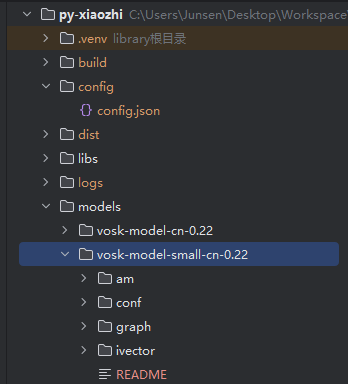

# Voice Wake-Up Feature

## Wake Word Model

Using the voice wake-up feature requires downloading and configuring a wake word model:

- [Download Wake Word Model](https://alphacephei.com/vosk/models)
- After downloading, extract the files to the root directory under `/models`
- By default, the system uses the `vosk-model-small-cn-0.22` small model
- 

## Enabling Voice Wake-Up

1. Open the configuration file at `/config/config.json`
2. Set `WAKE_WORD_OPTIONS.USE_WAKE_WORD` to `true`
3. Customize the wake words in the `WAKE_WORD_OPTIONS.WAKE_WORDS` array
4. Ensure that `WAKE_WORD_OPTIONS.MODEL_PATH` is correctly set to the path of your downloaded model

Example configuration:
```json
{
  "WAKE_WORD_OPTIONS": {
    "USE_WAKE_WORD": true,
    "MODEL_PATH": "models/vosk-model-small-cn-0.22",
    "WAKE_WORDS": [
      "Xiaozhi",
      "Hello Xiaozhi",
      "Hey Xiaozhi"
    ]
  }
}
```

## How to Use

1. After starting the program, the system will load the wake word model and automatically enter wake word listening mode
2. Say the wake word you configured (e.g., "Xiaozhi"), and the system will switch from IDLE to LISTENING mode
3. You can then proceed to give your command
4. If no command is given, the system will return to wake word listening mode after a short period

## Notes

1. Loading the wake word model takes some time; please be patient
2. The accuracy of wake word recognition depends on the model quality and environmental noise
3. You can try different model sizes; smaller models are faster but less accurate
4. Consider using unique wake words to avoid accidental triggers
5. Using the wake word feature may slightly increase system resource usage
