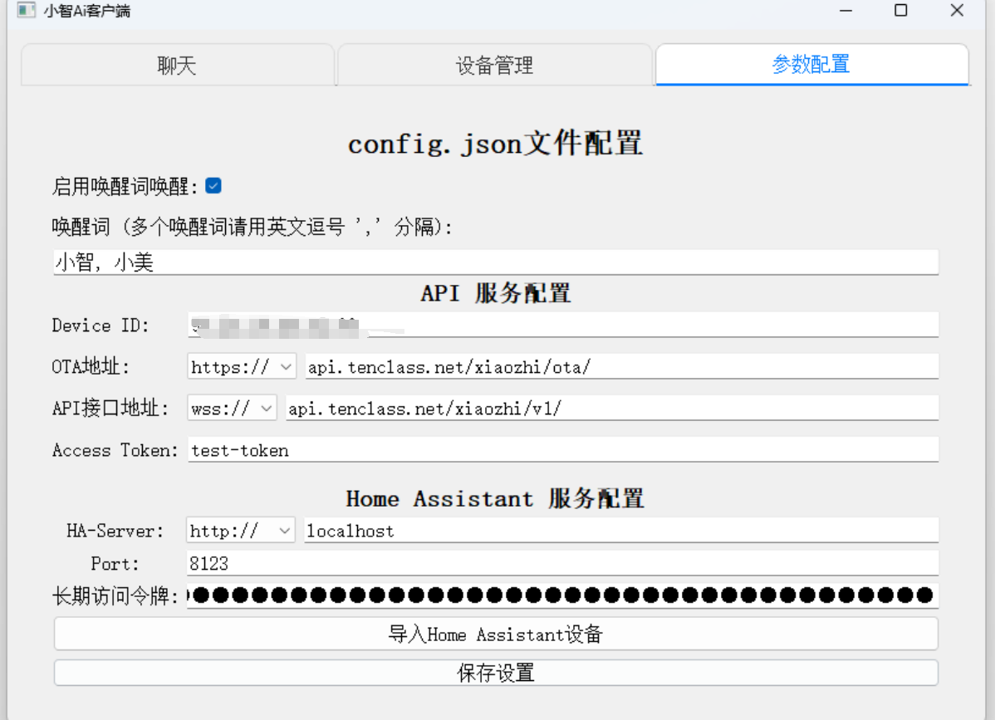
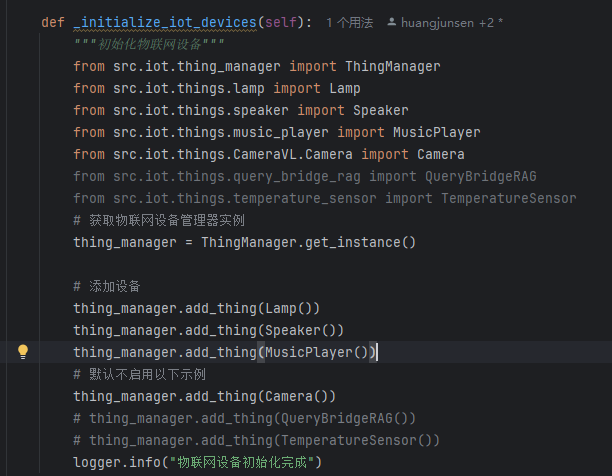
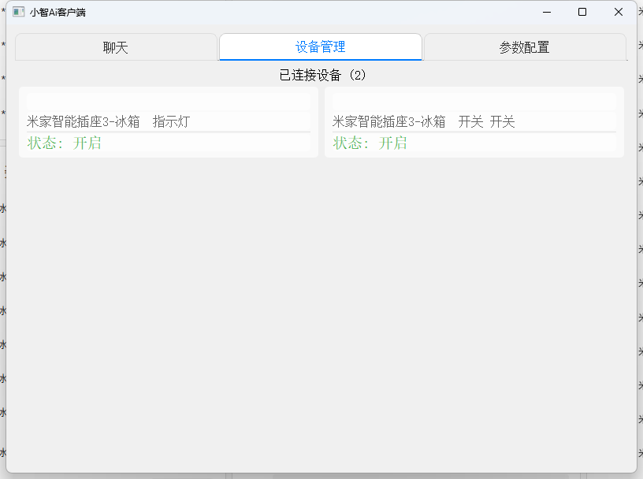

# IoT Functionality Description

## Overview

The IoT (Internet of Things) module in the py-xiaozhi project provides a flexible and extensible device control framework, supporting control of various virtual and physical devices through voice commands. This document details the architecture, usage, and how to extend custom devices for the IoT module. For immediate state synchronization and result broadcasting, refer to the camera module and temperature-humidity module.

## Core Architecture

The IoT module adopts a layered design and consists of the following main components:

```
├── iot                          # IoT-related modules
│   ├── things                   # Directory for specific device implementations
│   │   ├── lamp.py              # Lamp device implementation
│   │   ├── speaker.py           # Volume control implementation
│   │   ├── music_player.py      # Music player implementation
│   │   ├── countdown_timer.py   # Countdown timer implementation
│   │   ├── ha_control.py        # Home Assistant device control
│   │   ├── CameraVL/            # Camera and vision recognition integrated devices
│   │   ├── temperature_sensor.py# Temperature sensor implementation
│   │   └── query_bridge_rag.py  # RAG retrieval bridge device
│   ├── thing.py                 # IoT device base and utility class definitions
│   │   ├── Thing                # IoT device abstract base class
│   │   ├── Property             # Device property class
│   │   ├── Parameter            # Device method parameter class
│   │   └── Method               # Device method class
│   └── thing_manager.py         # IoT device manager
│       └── ThingManager         # Singleton device manager implementation
```

### Core Class Descriptions

1. **Thing (Device Base Class)**:
    - Abstract base class for all IoT devices.
    - Provides mechanisms for registering properties and methods.
    - Supports JSON serialization of state and description.

2. **Property (Property Class)**:
    - Defines mutable states of devices (e.g., on/off, brightness).
    - Supports three basic types: boolean, numeric, and string.
    - Uses getter callbacks to fetch device states in real-time.

3. **Method (Method Class)**:
    - Defines executable actions for devices (e.g., turn on, turn off).
    - Supports parameterized method calls.
    - Uses callbacks to implement specific operations.

4. **Parameter (Parameter Class)**:
    - Defines parameter specifications for methods.
    - Includes name, description, type, and whether it is required.

5. **ThingManager (Device Manager)**:
    - Manages all IoT device instances centrally.
    - Handles device registration and command dispatch.
    - Provides interfaces for device description and state queries.

## Command Processing Flow

The following illustrates the complete flow of processing voice commands and executing IoT device control:

```
                                        +-------------------+
                                        |   User Voice Command |
                                        +-------------------+
                                                    |
                                                    v
                                        +-------------------+
                                        |   Speech Recognition |
                                        |       (STT)         |
                                        +-------------------+
                                                    |
                                                    v
                                        +-------------------+
                                        |   Semantic Understanding |
                                        |         (LLM)           |
                                        +-------------------+
                                                    |
                                                    v
                                        +-------------------+
                                        |   IoT Command Generation |
                                        +-------------------+
                                                    |
                                                    v
+------------------------------+       |       +------------------------------+
|    WebSocket Server Handling |       |       | Application._handle_iot_message() |
|                             <--------+------->                             |
+------------------------------+               +------------------------------+
                                                                              |
                                                                              v
                                                              +------------------------------+
                                                              |   ThingManager.invoke()      |
                                                              +------------------------------+
                                                                              |
                             +-------------------------+----------+------------+
                             |                         |                       |
                             v                         v                       v
        +---------------+-------+    +------------+---------+   +---------+----------+
        |       Lamp            |    |      Speaker         |   |    MusicPlayer     |
        | (Controls Lamp Device)|    | (Controls System Volume)|   | (Music Player)   |
        +---------------+-------+    +------------+---------+   +---------+----------+
                             |                         |                       |
                             v                         v                       v
        +---------------+-------+    +------------+---------+   +---------+----------+
        | Executes Device Action |    | Executes Device Action |   | Executes Device Action |
        +---------------+-------+    +------------+---------+   +---------+----------+
                             |                         |                       |
                             +-------------------------+-----------------------+
                                                              |
                                                              v
                                              +-----------------------------+
                                              |    Update Device State      |
                                              | Application._update_iot_states() |
                                              +-----------------------------+
                                                              |
                                                              v
                                              +-----------------------------+
                                              |   Send State Update to Server |
                                              |       send_iot_states()       |
                                              +-----------------------------+
                                                              |
                                                              v
                                              +-----------------------------+
                                              |   Voice or UI Feedback Result |
                                              +-----------------------------+
```

## Built-in Device Descriptions

### 1. Lamp Device

A virtual lamp device used to demonstrate basic IoT control functionality.

**Properties**:
- `power`: Lamp on/off state (boolean).

**Methods**:
- `TurnOn`: Turns the lamp on.
- `TurnOff`: Turns the lamp off.

**Voice Command Examples**:
- "Turn on the lamp."
- "Turn off the lamp."

### 2. System Volume Control (Speaker)

Controls the system volume, allowing adjustment of application volume levels.

**Properties**:
- `volume`: Current volume level (0-100).

**Methods**:
- `SetVolume`: Sets the volume level.

**Voice Command Examples**:
- "Set the volume to 50%."
- "Increase the volume."
- "Decrease the volume."

### 3. Music Player (MusicPlayer)

A feature-rich online music player supporting song search, playback control, and lyrics display.

**Properties**:
- `current_song`: Currently playing song.
- `playing`: Playback state.
- `total_duration`: Total song duration.
- `current_position`: Current playback position.
- `progress`: Playback progress.

**Methods**:
- `Play`: Plays a specified song.
- `Pause`: Pauses playback.
- `GetDuration`: Retrieves playback information.

**Voice Command Examples**:
- "Play Jay Chou's 'Rice Fragrance' using the IoT music player."
- "Pause playback."
- "Play the next song."

### 4. Countdown Timer (CountdownTimer)

A countdown timer device used for delayed command execution.

**Properties**:
- No queryable properties.

**Methods**:
- `StartCountdown`: Starts a countdown and executes a specified command upon completion.
  - `command`: IoT command to execute (JSON string).
  - `delay`: Delay time (seconds), default is 5 seconds.
- `CancelCountdown`: Cancels a specified countdown.
  - `timer_id`: ID of the timer to cancel.

**Voice Command Examples**:
- "Set a 5-second timer to turn on the lamp."
- "Set a 10-second timer to set the volume to 70%."
- "Cancel countdown 3."

### 5. Temperature Sensor (TemperatureSensor)

A temperature-humidity sensor device connected via MQTT protocol, providing real-time environmental data.

**Properties**:
- `temperature`: Current temperature (Celsius).
- `humidity`: Current humidity (%).
- `last_update_time`: Last update timestamp.

**Methods**:
- No callable methods; the device automatically updates state via MQTT.

**Special Features**:
- Automatically broadcasts results via voice when new data is received.

**Voice Command Examples**:
- "What is the current indoor temperature?"
- "What is the indoor humidity?"
- "What is the status of the temperature sensor?"

### 6. Home Assistant Device Control (HomeAssistantDevice)

Controls various smart devices connected to the Home Assistant platform via HTTP API.

#### 6.1 HomeAssistant Light Device (HomeAssistantLight)

**Properties**:
- `state`: Light state (on/off).
- `brightness`: Light brightness (0-100).
- `last_update`: Last update timestamp.

**Methods**:
- `TurnOn`: Turns the light on.
- `TurnOff`: Turns the light off.
- `SetBrightness`: Sets the light brightness.
  - `brightness`: Brightness value (0-100%).

**Voice Command Examples**:
- "Turn on the living room light."
- "Set the bedroom light brightness to 60%."
- "Turn off all lights."

#### 6.2 HomeAssistant Switch (HomeAssistantSwitch)

**Properties**:
- `state`: Switch state (on/off).
- `last_update`: Last update timestamp.

**Methods**:
- `TurnOn`: Turns the switch on.
- `TurnOff`: Turns the switch off.

**Voice Command Examples**:
- "Turn on the fan."
- "Turn off the air conditioner."

#### 6.3 HomeAssistant Number Controller (HomeAssistantNumber)

**Properties**:
- `state`: Current state (on/off).
- `value`: Current value.
- `min_value`: Minimum value.
- `max_value`: Maximum value.
- `last_update`: Last update timestamp.

**Methods**:
- `TurnOn`: Turns the device on.
- `TurnOff`: Turns the device off.
- `SetValue`: Sets a value.
  - `value`: Value to set.

**Voice Command Examples**:
- "Set the air conditioner temperature to 26 degrees."
- "Set the fan speed to level 3."

#### 6.4 HomeAssistant Button (HomeAssistantButton)

**Properties**:
- `state`: Current state (on/off, usually virtual).
- `last_update`: Last update timestamp.

**Methods**:
- `TurnOn`: Activates the button (triggers a press action).
- `TurnOff`: Formal method, often has no practical effect.
- `Press`: Presses the button, triggering the associated action.

**Voice Command Examples**:
- "Press the doorbell button."
- "Trigger emergency mode."
- "Start scene playback."

### 7. Camera and Vision Recognition (CameraVL)

Integrates camera control and vision recognition functionality, allowing image capture and intelligent analysis.

**Features**:
- Turn the camera on/off.
- Intelligent image recognition.
- Visual content analysis.

**Voice Command Examples**:
- "Turn on the camera."
- "Recognize the image."
- "Turn off the camera."

## Extending Custom Devices

To add new IoT devices, follow these steps:

### 1. Create a Device Class

Create a new Python file in the `src/iot/things/` directory and define the device class.

### 2. Register the Device

Register the device in the `ThingManager` during application initialization.

### 3. Device Communication (Optional)

Implement communication protocols such as MQTT, HTTP, or GPIO for hardware interaction.

## Usage Examples

### Basic Device Control

1. Start the application.
2. Use the voice command "Turn on the lamp."
3. The system recognizes the command and executes the `TurnOn` method in `lamp.py`.
4. The lamp device state updates, and the user receives feedback: "The lamp is on."

### Music Playback Control

1. Use the command "Play Jay Chou's 'Rice Fragrance' using the IoT music player."
2. The system parses the command and calls the `Play` method of `MusicPlayer`.
3. The player searches for the song, starts playback, and displays lyrics.
4. Continue using commands like "Pause playback" to control playback.

### Countdown Control Example

1. Use the command "Set a 5-second timer to turn on the lamp."
2. The system parses the command and calls the `StartCountdown` method of `CountdownTimer`.
3. After 5 seconds, the lamp is turned on automatically.
4. The operation result is returned: "The countdown has been set."

### Home Assistant Device Control Example

1. Use the command "Dim the living room light."
2. The system parses the command and calls the `SetBrightness` method of `HomeAssistantLight`.
3. Sends a brightness adjustment command to Home Assistant via HTTP API.
4. Returns the operation result: "The living room light brightness has been adjusted."

## Notes

1. Device property updates are automatically pushed to the server and UI via WebSocket.
2. Device methods should consider asynchronous operations to avoid blocking the main thread.
3. Parameter types and formats should strictly follow the types defined in `ValueType`.
4. Ensure globally unique device IDs when adding new devices.
5. All device methods should implement appropriate error handling and feedback mechanisms.

## Advanced Topics: Home Assistant Integration

### Controlling Home Assistant via HTTP API

Home Assistant is a popular open-source home automation platform. This project integrates with Home Assistant via HTTP API to control various smart devices.

1. **Configuration File Settings**

Add Home Assistant configuration in `config/config.json`:

```json
{
  "HOME_ASSISTANT": {
     "URL": "http://your-homeassistant-url:8123",
     "TOKEN": "your-long-lived-access-token",
     "DEVICES": [
        {
          "entity_id": "light.cuco_cn_573924446_v3_s_13_indicator_light",
          "friendly_name": "Smart Plug Indicator Light"
        },
        {
          "entity_id": "switch.cuco_cn_573924446_v3_on_p_2_1",
          "friendly_name": "Smart Plug Switch"
        }
     ]
  }
}
```

### Configure HA Address and Token


### Device Selection
- Click the switch in the top left corner to toggle device types.
- Select devices and add them using the button in the bottom right corner.
- Restart the application after importing and wait for it to load before controlling via voice commands.



### After Import


2. **Supported Device Types**

- `light`: Light devices, supporting on/off and brightness control.
- `switch`: Switch devices, supporting on/off control.
- `number`: Numeric controllers, supporting value setting.
- `button`: Button devices, supporting press actions.

3. **Voice Command Examples**

- "Turn on the living room light."
- "Dim the bedroom light."
- "Set the air conditioner temperature to 26 degrees."
- "Turn off all lights."

### Communication Protocol Limitations

The current IoT protocol (version 1.0) has the following limitations:

1. **Unidirectional Control Flow**: The large model can only issue commands and cannot immediately retrieve execution results.
2. **State Update Delay**: Device state changes are only known during the next conversation by reading property values.
3. **Asynchronous Feedback**: If operation result feedback is needed, it must be implemented indirectly through device properties.

### Best Practices

1. **Use Meaningful Property Names**: Property names should clearly express their meaning for better understanding and usage by the large model.

2. **Avoid Ambiguity in Method Descriptions**: Provide clear natural language descriptions for each method to help the large model understand and call them accurately.
